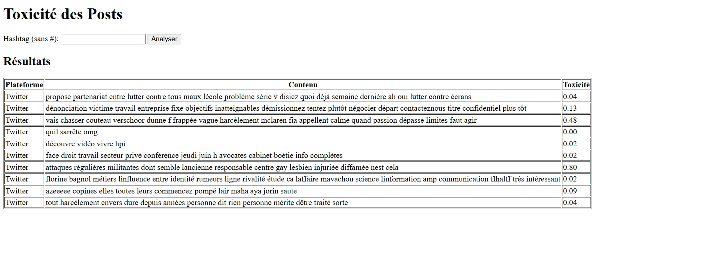

# Toxicity Analyzer for Social Media Posts

This project is a Flask-based web application that scrapes Twitter posts based on a hashtag, analyzes their toxicity using the Detoxify model, and displays the results on a simple web interface.

## 🌟 Features
- 🔍 Scrape Twitter posts using a hashtag
- 🧠 Detect toxic content using the Detoxify deep learning model
- 📄 Export analyzed posts to a CSV dataset
- 🖥️ Display results in a simple HTML interface
- 🐳 Deployable via Docker

## 📂 Project Structure
```bash
├── app.py # Main Flask application

├── models.py # Data class for posts

├── scraper.py # Twitter scraping logic (via Tweepy)

├── analyzer.py # Detoxify-based sentiment analyzer

├── dataset.py # Utility for saving post data to CSV

├── templates/
│ └── index.html # Frontend template for user interaction

├── var.env # Environment file containing BEARER_TOKEN
├── Dockerfile # Docker container definition
```
## 🔧 Environment Setup

### 1. Clone the repository
```bash
git clone https://github.com/your-username/toxicity-analyzer-app.git
cd toxicity-analyzer-app
```
## ⚙️ Requirements

- Python 3.8+
- [Flask](https://palletsprojects.com/p/flask/)
- [Tweepy](https://www.tweepy.org/)
- [Detoxify](https://github.com/unitaryai/detoxify)
- [dotenv](https://pypi.org/project/python-dotenv/)

***1. Install dependencies:***

```bash
pip install -r requirements.txt
```


***2. Set up environment variables***
Create a file named .env or var.env and add your Twitter Bearer Token:

```bash
BEARER_TOKEN=your_actual_bearer_token
```
***3. Install dependencies***
```bash
pip install -r requirements.txt
```
***4. Run the application***
```bash
python app.py
```
Visit: http://localhost:5000

## Functional Overview

## 1. `scraper.py` — Scraping Tweets  
**Class:** `SimpleScraper`  
**Purpose:** Retrieve tweets containing a specific hashtag using the Twitter API.  

### Functions:  
- `scrape_twitter_posts(limit: int)` – Scrapes recent tweets  
- `simulate_facebook_posts(limit: int)` – Generates dummy Facebook posts for testing  

### Tools:  
`tweepy`, `dotenv`, `os`, `logging`  

---

## 2. `models.py` — Post Data Model  
**Class:** `Post`  

**Purpose:** Data structure representing a social media post.  

### Attributes:  
- `content`: Text content of the post  
- `platform`: Source (Twitter or Facebook)  
- `toxicity`: Score between 0.0 (non-toxic) and 1.0 (very toxic)  

### Tools:  
`dataclasses`  

---

## 3. `post_cleaner.py` — Tweet Cleaning  
**Class:** `PostClean`  

**Purpose:** Preprocesses and cleans social media posts for toxicity analysis.  

### Functions:  
- `normalize_clean_tweets(raw_data)` – Cleans and normalizes a list of raw tweets  

### Cleaning Steps:  
- Removes emojis, punctuation, and special characters  
- Converts text to lowercase  
- Removes URLs, hashtags, and mentions  
- Removes French stopwords  
- Applies lemmatization  

### Tools:  
`re`, `nltk`, `emoji`, `spacy`, `logging`  

---

## 4. `mongodb_handler.py` — MongoDB Storage  
**Class:** `MongoDBHandler`  

**Purpose:** Stores cleaned and analyzed posts into a MongoDB collection.  

### Functions:  
- `insert_posts(posts: List[Post])` – Inserts cleaned posts into MongoDB  

### Stored Fields:  
- `content`: Cleaned post text  
- `platform`: Platform name (e.g., Twitter)  
- `toxicity`: Toxicity score  

### Tools:  
`pymongo`, `logging` 


## 5. `analyzer.py` — Toxicity Detection  
**Class:** `ToxicityAnalyzer`  
**Purpose:** Uses Detoxify to assign toxicity scores.  

### Functions:  
- `analyze(posts: List[Post])` – Applies the Detoxify model to a list of posts  

### Tools:  
`detoxify`, `logging`  

---

## 6. `dataset.py` — Save to CSV  
**Class:** `SimpleDataset`  
**Purpose:** Save analyzed data into a local CSV file.  

### Functions:  
- `save_to_csv(posts)` – Saves posts with toxicity scores to `toxicity_dataset.csv`  

### Tools:  
`csv`, `logging`  

---

## 7. `app.py` — Flask App Logic  
**Route:** `/`  
**Method:** `GET`, `POST`  

### Purpose:  
- Accept hashtag input from user  
- Scrape and clean Twitter posts
- Analyze twitter posts
- Save results to CSV/MongodB  
- Render them via an HTML template  

### Tools:  
`flask`, `render_template`, `request`  

---

## 8. `templates/index.html` — Web UI  
**Purpose:** Simple HTML interface using Jinja2  

### Components:  
- Hashtag input form  
- Results table showing:  
  - Platform  
  - Post content  
  - Toxicity score  

### Tools:  
`HTML`, `Jinja2`  

## 🐳 Docker Deployment
1. Dockerfile
```bash
dockerfile
FROM python:3.10-slim

WORKDIR /app

COPY . .

RUN pip install --upgrade pip
RUN pip install -r requirements.txt

EXPOSE 5000

CMD ["python", "app.py"]
```
2. Build Docker Image
```bash
docker build -t toxicity-app .
```
3. Run Docker Container
```bash
docker run -p 5000:5000 toxicity-app
Visit: http://localhost:5000
```
✅ Sample Output


